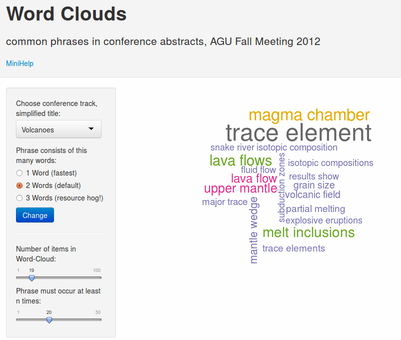

## Slide 2
### Information Overload in the Sciences

- Scientists are producing more scientific literature than ever before
- A staggering 6,000 papers are published every day 
- Source: [Nature News & Comment, Sept. 3, 2014](http://www.nature.com/news/how-to-tame-the-flood-of-literature-1.15806)

###  Information Overload in small subfields of the Sciences

- Even a single annual conference can release an overwhelming amount of information
- Let's develop a new tool to tame this
- Strategy: Interactively summarize the summaries
- First step: My Shiny-App ['Wordclouds'](https://rapps.shinyapps.io/wordcloud01/)  

--- 


## Slide 3

### Case study: Conference "AGU Fall Meeting 2012"

- The [American Geophysical Union (AGU)](http://en.wikipedia.org/wiki/American_Geophysical_Union) is a professional society for Earth Scientists. 
- Hosts annual big conference with more than 20000 participants from around the world.
- Nearly each participant gives a short talk or [presents a poster](https://www.youtube.com/watch?v=dFf1eZ5MAYA "Stroll from one end of the AGU poster session room to the other end (Fall Meeting 2011)").
- Over the years, number of participants has increased considerably.
```{r echo=F, return="hide"}
library(ggplot2)
options(warn=-1)
df <- data.frame(fromJSON("{\"year\":[\"2005\",\"2006\",\"2007\",\"2008\",\"2009\",\"2010\",\"2011\",\"2012\",\"2004\",\"2005\",\"2006\",\"2007\",\"2008\",\"2009\",\"2010\",\"2011\",\"2012\",\"2013\"],\"participants\":[\"8067\",\"7732\",\"8037\",\"8685\",\"9088\",\"10463\",\"10725\",\"11275\",\"11422\",\"12008\",\"13972\",\"14649\",\"16242\",\"16642\",\"19175\",\"22167\",\"24000\",\"22500\"],\"orals\":[\"NA\",\"NA\",\"NA\",\"NA\",\"NA\",\"4431\",\"4333\",\"4436\",\"NA\",\"NA\",\"NA\",\"NA\",\"NA\",\"NA\",\"5852\",\"6000\",\"6800\",\"7500\"],\"posters\":[\"NA\",\"NA\",\"NA\",\"NA\",\"NA\",\"9370\",\"8439\",\"9092\",\"NA\",\"15788\",\"NA\",\"NA\",\"15730\",\"NA\",\"11517\",\"12000\",\"14000\",\"15000\"],\"conference\":[\"EGU\",\"EGU\",\"EGU\",\"EGU\",\"EGU\",\"EGU\",\"EGU\",\"EGU\",\"AGU\",\"AGU\",\"AGU\",\"AGU\",\"AGU\",\"AGU\",\"AGU\",\"AGU\",\"AGU\",\"AGU\"]}"), stringsAsFactors=FALSE)

df <- df[df$conference=="AGU", ]
df$participants <- as.integer(df$participants)
df$posters <- as.integer(df$posters)
df$orals <- as.integer(df$orals)
df$year <- as.integer(df$year)


p2012 <- subset(df, year == 2012)
pt <- paste0("AGU Conference: Number of Participants over the years.\n In 2012:", " n = ", p2012[1,"orals"], " talks, ", p2012[1,"posters"], " posters.")
pl <- ggplot(data=df, aes(x = year, y =participants, colour=conference))
pl <- pl +    scale_colour_discrete(guide = FALSE) 
pl <- pl  + geom_point( size=3)
pl <- pl  + geom_line()   # this is the base plot
pl <- pl  + geom_point(data=p2012, colour="black")   # this adds a black point
pl <- pl + geom_text(data=p2012, label=paste0("AGU 2012"), colour="black", hjust=1.1) # this adds a label for the single point

pl <- pl + ggtitle(pt)
#options(warn=w)
#qplot(year, participants , data=df, color=conference)
# with(p2.tmp, {
# qplot(participants ~ year)
# }


```
```{r echo=FALSE, fig.align='center', fig.height=3, fig.width = 6}
pl


```

* * *
How to keep up-to-date with all this?

--- 

## Slide 4
### My Shiny App:  ['Word Clouds'](https://rapps.shinyapps.io/wordcloud01/)

<table width="1024px">
    <tr>
        <td>
</td>
               <td>
        <!---->
        <small>App visualizes the most common phrases used in conference abstracts</small><br>
<small>Each word-cloud picture "summarizes the summaries" of hundreds of science talks and posters.</small><br>
<small>This example is from conference track "Volcanology"</small><br>
<small>This picture incorporates n=1098 abstracts, each one ~1000 words </small><br>
<small>Size and color of phrases in word cloud is proportional to number of occurences </small><br>
<small>Generation of word clouds is <strong>interactive!</strong> </small> 
        </td>
    </tr>
        <tr>
        <td colspan="2">
        App GUI, Wordcloud of 2-word-phrases of Volcanology abstracts 
</td></tr>
</table>

--- 

## Slide 5

### Background Info
 
- Only a few complete conference topics are made queryable in app
- Data was gathered by manual harvesting from conference web sites. FYI, check out the [Volcanology Section](http://abstractsearch.agu.org/meetings/2013/FM/sections/V) 
- Downloading and tidying up data took much more time than creating the Shiny app. 
- In the Shiny app, workhorse R packages from CRAN are "tm" for text mining, "wordcloud" for generating wordclouds

### Outlook

- Many interesting results, can't discuss them here, as max. 5 slides already full
- Can do interactive wordcloud generation for any text collection, of any size. 
- My Business Plan: 1. Generate Wordclouds. 2. ??? 3. Profit!