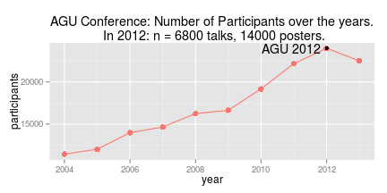
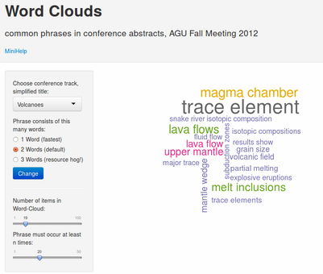
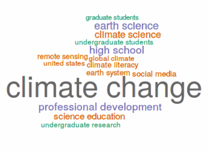

## Slide 2
### Information Overload in the STEM Sciences

- There is more scientific literature produced than ever before
- A staggering 6,000 papers are published every day 
- Source: [Nature News & Comment, Sept. 3, 2014](http://www.nature.com/news/how-to-tame-the-flood-of-literature-1.15806)

###  Information Overload in small subfields of sciences

- Even a single annual conference can release an overwhelming amount of information
- Let's develop a new tool to tame this
- Strategy: Interactively summarize the summaries
- First step: My Shiny-App ['Wordclouds'](https://rapps.shinyapps.io/wordcloud01/)  

--- 

## Slide 3

### Case study: Conference "AGU Fall Meeting 2012"

- The [American Geophysical Union (AGU)](http://en.wikipedia.org/wiki/American_Geophysical_Union) is a professional society for Earth Scientists. 
- Hosts annual big conference with more than 20000 participants from around the world.
- Nearly each participant gives a short talk or [presents a poster](https://www.youtube.com/watch?v=dFf1eZ5MAYA "Stroll from one end of the AGU poster session room to the other end (2011)").
- Over the years, number of participants has increased considerably.

* * *
Rapid technological progress in many fields, how to keep up-to-date with all this?

--- 

## Slide 4
### My Shiny App:  ['Word Clouds'](https://rapps.shinyapps.io/wordcloud01/)

<table width="1024px">
    <tr>
        <td>
</td>
               <td>
        <!---->
        <small>App visualizes the most common phrases used in conference abstracts, AGU Fall Meeting 2012</small> 
<small>Each word-cloud picture "summarizes the summaries" of hundreds of science talks and posters.</small> 
<small>This example is from conference track "Volcanology"</small> 
<small>This picture incorporates n=1098 abstracts, each one page long, ~1000 words </small> 
<small>Size and color of phrases in word cloud is proportional to number of occurences </small> 
<small>Generation of word clouds is <strong>interactive!</strong> </small> 
        </td>
    </tr>
        <tr>
        <td colspan="2">
        App GUI, Wordcloud of 2-word-phrases of Volcanology abstracts 
</td></tr>
</table>

--- 

## Slide 5

### Background Info
 
- Only a small subset of conference topics are made queryable in the UI of the app.
- Data was gathered by manual harvesting from conference web sites. FYI, check out the [Volcanology Section](http://abstractsearch.agu.org/meetings/2013/FM/sections/V) 
- Downloading and tidying up data took much more time than creating the Shiny app. 
- In the Shiny app, workhorse R packages from CRAN are "tm" for text mining, "wordcloud" for generating wordclouds

### Outlook

- Many interesting results, can't summarize them here, as max. 5 slides already full
- Can do interactive wordcloud generation for any text collection, of any size. 
- Classic Plan: **1.** Generate Wordclouds. **2.** ??? **3.** Profit!
